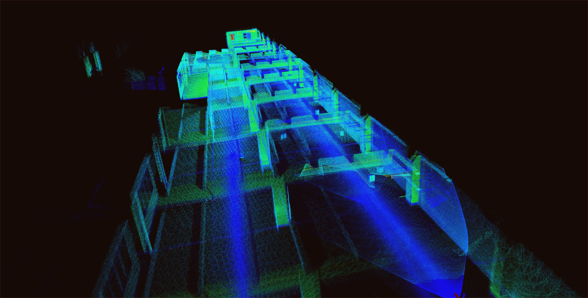
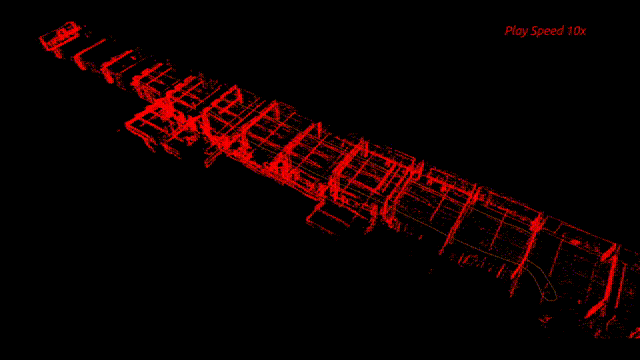
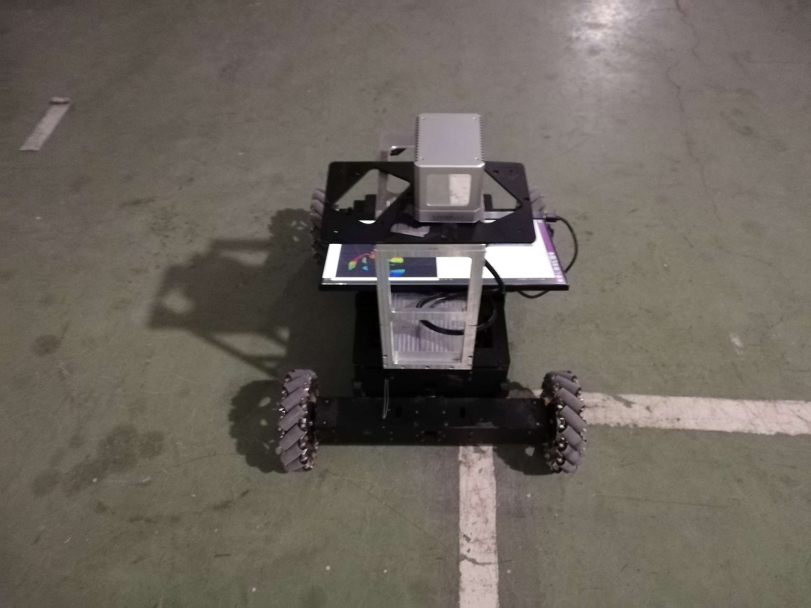
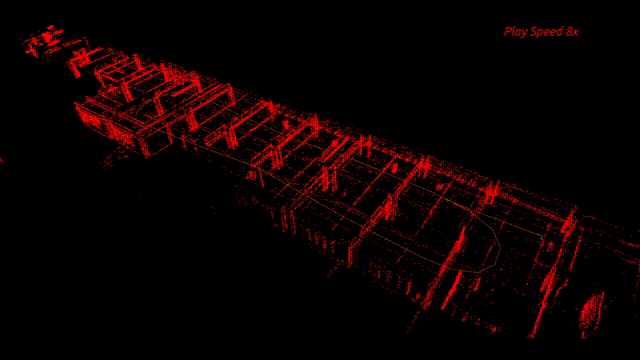

## Livox_Relocalization
Livox-Relocalization is a relocalization package for Livox LiDARs. This package load the map which create by mid40 and then use this map to relocate itself.

- Example map points:
<div align="center">
    
</div>

- Relocalization:
<div align="center">
    
</div>

## 1. Prerequisites
### 1.1 **Ubuntu** and **ROS**
Ubuntu 64-bit 16.04 or 18.04.
ROS Kinetic or Melodic. [ROS Installation](http://wiki.ros.org/ROS/Installation)

### 1.2. **PCL && Eigen && openCV**
Follow [PCL Installation](http://www.pointclouds.org/downloads/linux.html).
Follow [Eigen Installation](http://eigen.tuxfamily.org/index.php?title=Main_Page).
Follow [openCV Installation](https://opencv.org/releases/).

### 1.3. **livox_ros_driver**
Follow [livox_ros_driver Installation](https://github.com/Livox-SDK/livox_ros_driver).


## 2. Build
Clone the repository and catkin_make:

```
    cd ~/catkin_ws/src
    git clone https://github.com/Livox-SDK/livox_relocalization.git
    cd ../
    catkin_make
    source ~/catkin_ws/devel/setup.bash
```
## 3. Get lidar map
Download [map_example](https://terra-1-g.djicdn.com/65c028cd298f4669a7f0e40e50ba1131/Showcase/map_example.zip) or use your own mid40 to create a map and save it to pcd file. You can use our mapping package [livox_mapping](https://github.com/Livox-SDK/livox_mapping) to create this map.

The map_example.zip include four files {all_points.pcd corner.pcd surf.pcd key_frame.txt}.

Move these files{all_points.pcd corner.pcd surf.pcd key_frame.txt} to .../livox_relocalization/map 
Change the 'map_file_path' in livox_relocalization.launch to your own path.

## 4. Rosbag example
Download [mid40_re_example](https://terra-1-g.djicdn.com/65c028cd298f4669a7f0e40e50ba1131/Showcase/mid40_re_example.bag) and then
```
roslaunch livox_relocalization livox_relocalization.launch
rosbag play YOUR_DOWNLOADED.bag
```

## 5. Directly run
First you should get your own map and load it,then connect to your PC to Livox LiDAR (mid40) by following  [Livox-ros-driver installation](https://github.com/Livox-SDK/livox_ros_driver), then
```
    ....
    roslaunch livox_relocalization livox_relocalization.launch
    
```
*Remarks:*
- In this version, the initial pose still needs to be close to the original trajectory, especially the rotation.
- When the paramter 'use_map_update' is setted to 'true', the map will be updated during the relocalization process, otherwise only the original map is used.

## 6.AMR(Automated Mobile Robot) example
With the control algorithm, you can DIY an automated mobile car as shown below.
<div align="center">
    
</div>

- Line track example:
<div align="center">
    
</div>

## 7.Acknowledgments
Thanks for LOAM(J. Zhang and S. Singh. LOAM: Lidar Odometry and Mapping in Real-time), [LOAM_NOTED](https://github.com/cuitaixiang/LOAM_NOTED).
